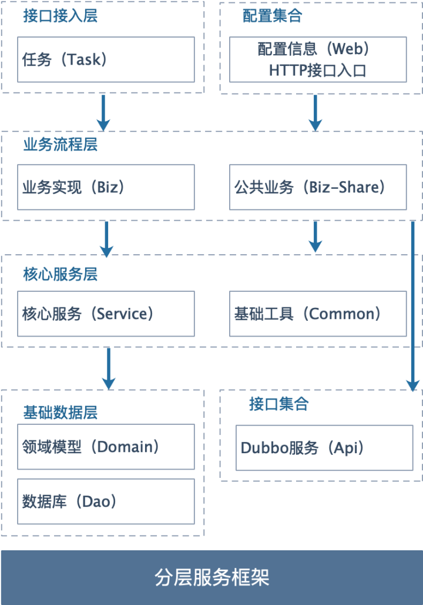
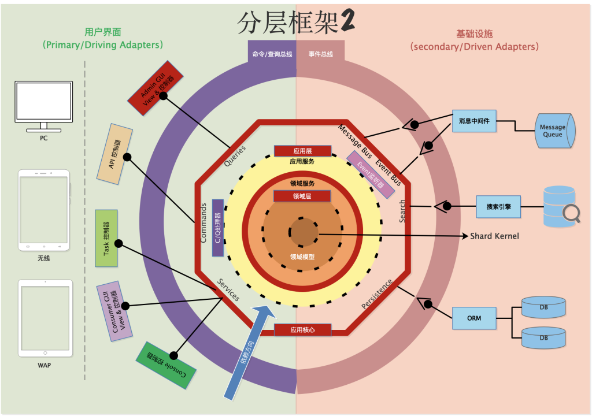
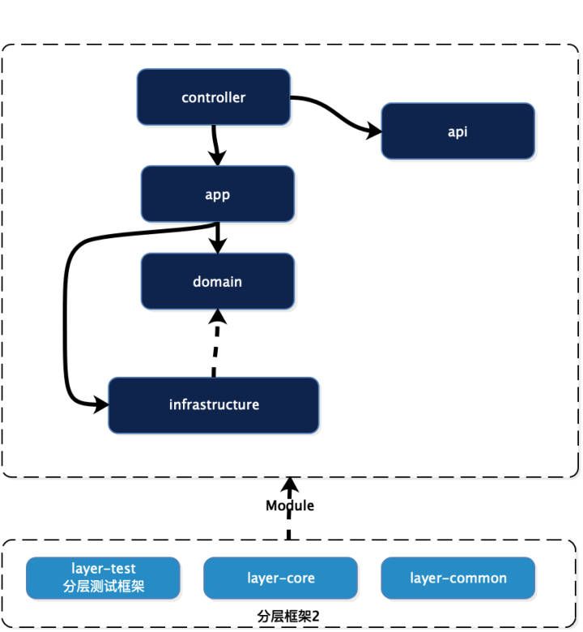
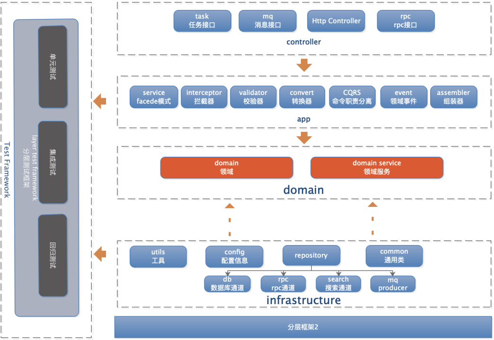

# 1.什么是clean architecture？
&emsp;&emsp;我对整洁代码的定义是： 
&emsp;&emsp;整洁架构，既是与数据库无关性，与客户端接口无关性，与各种框架无关性。提倡以业务为核心，解耦外部依赖，分离业务复杂度和技术复杂度，以达到减少熵增，最小化系统的维护和开发成本。
# 2.为什么要clean architecture？
- 个人立场：一个卓越的软件工程师应该有的一种追求。
- 公司立场：最大化程序员的生产力，同时最小化系统的维护成本，即是用最少的人力成本满足构建和维护该系统需求。
# 3.怎么实现clean architecture？
&emsp;&emsp;我个人在这么多年的职业生涯中，总结了落地整洁架构的三板斧：
- 第一板斧，采用六边形架构+洋葱架构：组件拆分，解决分层，解决层次的依赖和耦合，业务逻辑和技术细节解耦；
- 第二板斧，CQRS：单一职责职责分离，反脆弱设计，业务解耦，提高内聚性；
- 第三板斧，DDD：实现按域拆分，面向对象。
# 4.clean architecture项目示例
&emsp;&emsp;可以参考我在github开源的项目：
- [分层框架 1.0：ark-layer-framework](https://github.com/javaboy863/ark-layer-framework)
  

     
  

   
- 分层框架 2.0：ark-layer-framework 
  

     
     
     
  

     
- 整洁架构实践的示例项目：[ark-sample-clean-code](https://github.com/javaboy863/ark-sample-clean-code)
# 5.参考资料
- [clean architecture](https://blog.cleancoder.com/uncle-bob/2012/08/13/the-clean-architecture.html)