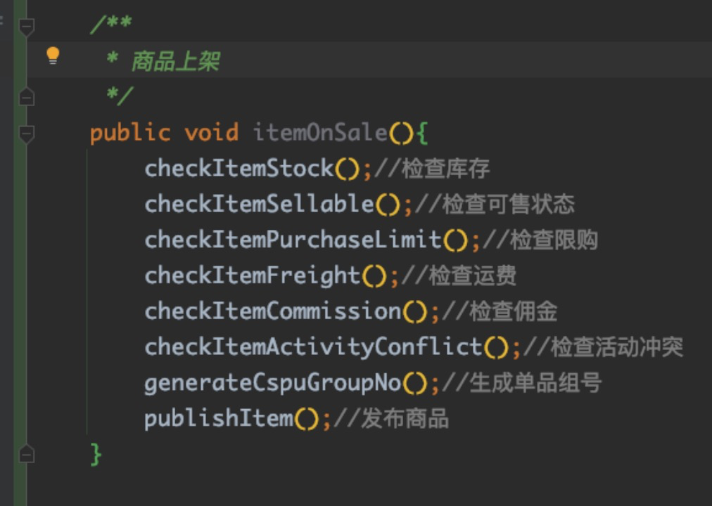

# 1.什么是clean code？
&emsp;&emsp;我对整洁代码的定义是：代码整洁是一种以读者为中心的开发风格，以此开发的软件易于读写和维护。开发总以为他们的工作在应用程序能够正常运行时就完成了。但是我们编写代码，并不只是为了给计算机用。你的代码读者不只是计算机，还是活生生的人！ 
&emsp;&emsp;当然，如果一定要在准确些的话，《clean code》书中给出了总结：
- 优雅且高效；直截了当；减少依赖；只做好一件事
- 简单直接
- 可读，可维护，单元测试
- 不要重复、单一职责，表达力（Expressiveness）
# 2.为什么要clean code？
- 个人立场：一个卓越的软件工程师应该有的一种追求。
- 公司立场：高质量的代码，能够提高团队的开发效率，降低维护成本，提高代码的可读性，降低代码的bug率，提高代码的可维护性，降低代码的复杂度。
# 3.怎么实现clean code？
&emsp;&emsp;我个人在这么多年的职业生涯中，总结了实现整洁代码的三板斧：
- 第一板斧：代码评分 
  

     
  

  - 包括：单元测试覆盖率，坏味道，漏洞级别（是阻断级别、严重级别、主要级别），缺陷级别（阻断级别、严重级别、主要级别），注释率 ，代码覆盖率，线上发生故障，性能：接口TP99，慢查询，SLA，无效报警量等
- 第二板斧：结构化编程
  

    
    
  

- 第三板斧：领域建模
    - 过程分解后的两个问题：
      - 1、领域知识比较割裂（每个Use Case的代码只关心自己的处理流程，知识没有沉淀，代码重复度高，对业务语义的表达能力很弱，从而影响代码的可读性和可理解性）;
      - 2、代码的业务表达能力缺失 
    - 因此需要领域建模，将业务领域的知识沉淀到代码中，从而提高代码的可读性和可理解性
# 4.clean code项目示例
&emsp;&emsp;可以参考我在github开源的另一个项目：[weather-platform](https://github.com/javaboy863/weather-platform)
# 5.参考资料
- [《clean code》](https://book.douban.com/subject/4199741/)